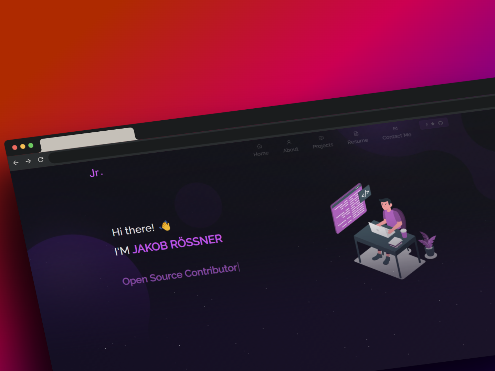

<h2 align="center">
  Portfolio Website - v2.0 
  <a href="http://www.roessner.tech/" target="_blank">roessner.tech</a>
</h2>

  

 

 &nbsp;
 &nbsp;
 &nbsp;
 &nbsp;

<h3 align="center">
    🔹
    <a href="https://github.com/FleetAdmiralJakob/Portfolio/issues">Report Bug</a> &nbsp; &nbsp;
    🔹
    <a href="https://github.com/FleetAdmiralJakob/Portfolio/issues">Request Feature</a>
</h3>

## TL;DR

You can fork this repo to modify and make changes of your own. Please give me proper credit by linking back
to [FleetAdmiralJakob](https://github.com/FleetAdmiralJakob/Portfolio). Thanks!

## Built With

My personal portfolio <a href="http://www.roessner.tech/" target="_blank">roessner.tech</a> which features some of my
GitHub projects as well as my resume and technical skills. 

This project was built using these technologies.

- ReactJS
- Node.js
- Express.js
- CSS3
- Sass
- Webstorm
- VSCode
- Typescript

## Features

**📖 Multi-Page Layout**

**🎨 Styled with React-Bootstrap and CSS with easy to customize colors**

**📱 Fully Responsive**

## Getting Started

Clone down this repository. You will need `node.js` and `git` installed globally on your machine.

## 🛠 Installation and Setup Instructions

1. Installation: `npm ci`

2. In the project directory, you can run: `npm start`

Runs the app in the development mode.\
Open [http://localhost:3000](http://localhost:3000) to view it in the browser.
The page will reload if you make edits.

## 🚀 To deploy using gh-pages module on GitHub page run the following command.

1. In package.json update `"homepage": ""` by adding your GitHub page url.
2. `npm run deploy`
3. Go to settings -> pages -> build and deployment -> choose `gh-pages` as root branch

## Usage Instructions

Open the project folder and Navigate to `/src/components/`.  
You will find all the components used, and you can edit your information accordingly.

<!-- ## Overview -->
<!--  -->

## License

    Copyright 2023 Jakob Felix Eugen Rössner

    Licensed under the Apache License, Version 2.0 (the "License");
    you may not use this file except in compliance with the License.
    You may obtain a copy of the License at

        http://www.apache.org/licenses/LICENSE-2.0

    Unless required by applicable law or agreed to in writing, software
    distributed under the License is distributed on an "AS IS" BASIS,
    WITHOUT WARRANTIES OR CONDITIONS OF ANY KIND, either express or implied.
    See the License for the specific language governing permissions and
    limitations under the License.
